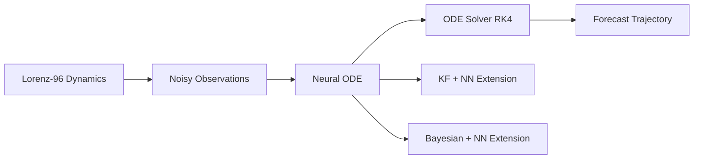

# Report Outline

## Suggested Title
Neural ODE for Atmospheric Forecasting: Learning Dynamics by Solving Ordinary Differential Equations

## Subtitle Option
Baseline Neural ODE, Kalman-Enhanced Forecasting, and Bayesian Uncertainty Modeling on Lorenz-96

## 1. Introduction

### Slide 1. Background
- Atmospheric prediction is fundamentally a dynamical systems problem.
- Traditional forecasting relies on physical equations and numerical solvers.
- Recent neural methods improve flexibility, but often lose the continuous-time structure of the underlying system.

### Slide 2. Project Motivation
- The goal of this capstone is to use a Neural ODE to learn system dynamics and perform atmospheric forecasting by solving the learned ODE.
- This keeps the forecasting pipeline close to the language of dynamical systems: state evolution, time derivatives, and numerical integration.
- The broader motivation is to explore whether data-driven continuous-time models can provide accurate and interpretable forecasts under noisy observations.

### Slide 3. Research Questions
- Can a Neural ODE learn the dynamics of a chaotic atmospheric-style system well enough for autonomous forecasting?
- Does adding Kalman-style filtering improve robustness when observations are noisy?
- Does Bayesian modeling provide useful predictive uncertainty in addition to point accuracy?

## 2. Problem Setup

### Slide 4. Dynamical System
- We use the Lorenz-96 system as a simplified atmospheric benchmark.
- The system is low-dimensional but chaotic, which makes forecasting nontrivial.
- In this project, the state dimension is `N_VARS = 10` and the forcing parameter is `F = 8.0`.

### Slide 5. Data Generation
- Ground-truth trajectories are generated by RK4 integration with `DT = 0.01` over `T = 30s`.
- Gaussian noise is added to create observations with `NOISE_STD = 0.5`.
- The time interval `0-20s` is used for training, and `20-30s` is used for autonomous prediction.

### Slide 6. Evaluation Metrics
- Component-wise RMSE to measure error for each state variable.
- Total RMSE to summarize overall forecasting quality.
- For Bayesian models, uncertainty quality can also be evaluated through interval coverage or calibration.

## 3. Core Method: Neural ODE

### Slide 7. Neural ODE Formulation
- The model learns a vector field of the form `dy/dt = f_theta(y)`.
- Here, `f_theta` is represented by a multilayer perceptron.
- Once the vector field is learned, forecasting is performed by numerically solving the ODE forward in time.

### Slide 8. Why Neural ODE
- Neural ODE provides a continuous-time representation rather than a purely step-to-step mapping.
- This is more consistent with the structure of atmospheric evolution.
- It also allows the model forecast to be interpreted as integrating learned dynamics.

### Slide 9. Numerical Solver and Training
- Both training and inference use RK4, ensuring consistency between learning and prediction.
- Training uses multi-step free-rollout loss so the model learns to remain stable during autonomous evolution.
- This is important because forecasting quality depends not only on one-step accuracy, but also on how errors accumulate over time.

## 4. Extensions Beyond the Baseline

### Slide 10. Extension I: KF+NN
- The first extension combines the neural dynamics model with Kalman-style filtering.
- The intuition is that filtering can reduce the effect of noisy observations by updating the state estimate before further rollout.
- This method is expected to improve short-term state tracking and reduce drift.

### Slide 11. Extension II: Bayesian+NN
- The second extension introduces uncertainty-aware neural forecasting.
- Instead of producing only a single deterministic trajectory, the model also provides predictive uncertainty.
- This is useful because chaotic atmospheric systems become increasingly uncertain over longer horizons.

### Slide 12. Why These Extensions Matter
- The baseline Neural ODE focuses on learning dynamics.
- KF+NN focuses on state correction under noisy measurements.
- Bayesian+NN focuses on confidence estimation and probabilistic forecasting.
- Together, they show how the same Neural ODE forecasting framework can be enhanced in different directions.

## 5. Experimental Design

### Slide 13. Training Strategy
- The baseline model uses a multilayer perceptron to parameterize the vector field.
- Training is performed with multi-step rollout windows controlled by `H_MAX`.
- Optimization uses AdamW, and gradients are clipped for stability.

### Slide 14. Forecasting Protocol
- For evaluation, the model starts from the true state at the train/test split time.
- It then rolls forward autonomously from `20s` to `30s`.
- This setup tests whether the learned dynamics can sustain accurate prediction without continual correction.

### Slide 15. Comparison Setting
- All methods should be compared under the same initial condition, data split, and noise level.
- The baseline Neural ODE serves as the core reference.
- KF+NN and Bayesian+NN are evaluated as improvements on top of the same forecasting task.

## 6. Results and Discussion

### Slide 16. Main Result
- The primary question is whether Neural ODE can learn meaningful atmospheric-style dynamics and generate stable forecasts.
- This should be shown first, before introducing the extensions.

### Slide 17. Comparison Across Methods
- Compare Neural ODE, KF+NN, and Bayesian+NN on the same forecasting window.
- Highlight accuracy differences, forecast stability, and sensitivity to noise.
- Emphasize that the baseline is the main contribution, while KF and Bayesian methods are enhancements.

### Slide 18. Interpretation
- If KF+NN performs better, this suggests that filtering improves robustness to noisy observations.
- If Bayesian+NN provides useful uncertainty bands, this shows the value of probabilistic forecasting in chaotic systems.
- Even when RMSE is similar, uncertainty calibration may still be a major advantage.

## 7. Recommended Figures

### Figure 1. Overall framework
Use one overview diagram to show the project logic.

### Figure 2. Forecast trajectories
- Plot true trajectory and predicted trajectory for `x1`, `x5`, and `x10`.
- Mark the train/forecast split at `t = 20s`.
- Show all three methods in the same visual style for easy comparison.

### Figure 3. RMSE over time
- Plot forecasting error as a function of time.
- This figure clearly shows how error accumulates during autonomous rollout.

### Figure 4. Uncertainty band
- For Bayesian+NN, plot predictive mean with confidence or credible intervals.
- Overlay the true trajectory to show whether uncertainty expands in difficult regions.

### Figure 5. Quantitative summary table
- Present total RMSE and mean component-wise RMSE for all methods.
- This should be the main comparison table in the report.

## 8. Suggested Results Table

| Method | Total RMSE | Mean RMSE | Strength |
|---|---:|---:|---|
| Neural ODE | TBD | TBD | Continuous-time forecasting baseline |
| KF+NN | TBD | TBD | Better robustness to noisy observations |
| Bayesian+NN | TBD | TBD | Predictive uncertainty and calibration |

## 9. Conclusion

### Slide 19. Key Takeaway
- The central contribution of this capstone is a Neural ODE framework for atmospheric forecasting.
- The forecast is produced by numerically solving a learned ODE rather than directly mapping one time step to the next.
- This makes the method naturally aligned with dynamical systems thinking.

### Slide 20. Final Message
- Neural ODE is the core forecasting model.
- KF+NN improves filtering under noisy observations.
- Bayesian+NN adds uncertainty awareness for more reliable prediction.
- Together, these results show a progression from deterministic dynamics learning to more robust and informative forecasting.

## 10. Closing Sentence for Presentation
This project shows that atmospheric forecasting can be framed as learning dynamics in continuous time, where the forecast is obtained by solving a learned ODE, and where filtering and Bayesian inference can further improve robustness and reliability.
# NODEs---capstone
